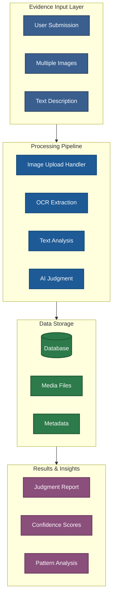
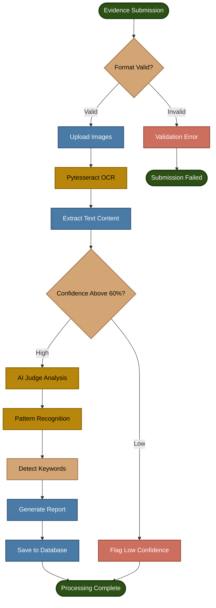
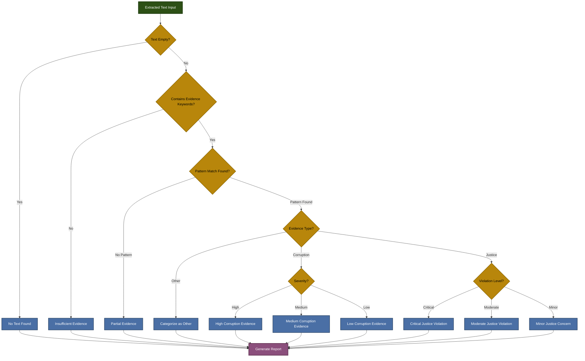
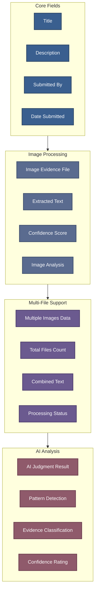
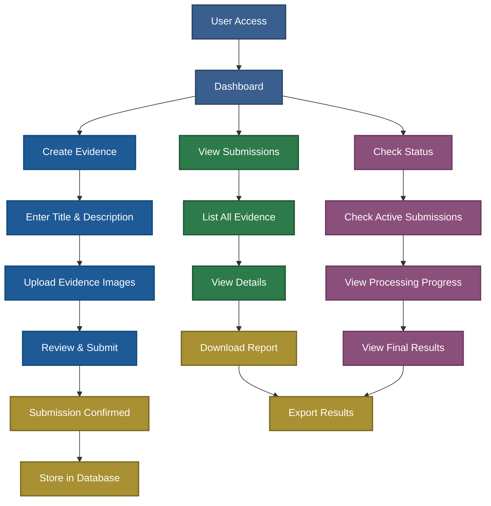
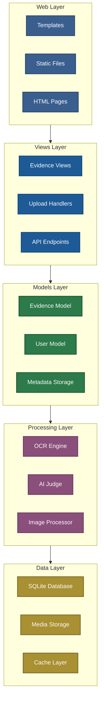

# Capstone-Project

# SDG16 Evidence Judgment System

A sophisticated Django-based application for submitting, processing, and AI-analyzing evidence related to Sustainable Development Goal 16 (Peace, Justice and Strong Institutions). The system integrates OCR technology, AI analysis, and image processing to validate evidence submissions.

## Project Overview

This application enables organizations and individuals to submit evidence of corruption, justice violations, and institutional accountability. Each submission undergoes multi-stage processing including OCR extraction, AI judgment, and confidence scoring.

## System Architecture



## Evidence Processing Flow



## AI Judgment Decision Tree



## Evidence Model Structure



## User Workflow



## Django Application Structure



## Installation

### Prerequisites

- Python 3.8 or higher
- Django 3.2 or higher
- Pillow for image processing
- pip for package management

### Setup Instructions

1. Clone the repository:
```bash
git clone https://github.com/your-repo/sdg16-evidence-system.git
cd sdg16
```

2. Create and activate virtual environment:
```bash
python -m venv venv
source venv/bin/activate  # On Windows: venv\Scripts\activate
```

3. Install dependencies:
```bash
pip install -r requirements.txt
```

4. Run migrations:
```bash
python manage.py migrate
```

5. Create superuser:
```bash
python manage.py createsuperuser
```

6. Run development server:
```bash
python manage.py runserver
```

Access the application at `http://localhost:8000`

## Core Features

### Evidence Submission
- Multi-image upload with support for multiple formats
- Real-time OCR text extraction
- Confidence scoring for extracted text
- Full metadata capture and storage

### AI Analysis
- Keyword-based evidence classification
- Pattern recognition for corruption indicators
- Justice violation detection
- Automatic severity assessment

### Processing Pipeline
- Asynchronous multi-file processing
- Error handling and recovery mechanisms
- Progress tracking for long submissions
- Detailed processing status reports

### Data Management
- Secure evidence storage
- Complete audit trail
- Export capabilities
- Search and filter functionality

## API Endpoints

### Evidence Management
- `POST /api/evidence/submit/` - Submit new evidence
- `GET /api/evidence/list/` - List all submissions
- `GET /api/evidence/<id>/` - Get evidence details
- `DELETE /api/evidence/<id>/` - Delete evidence

### Processing Status
- `GET /api/status/<submission_id>/` - Get processing status
- `GET /api/results/<submission_id>/` - Get analysis results

### Image Operations
- `POST /api/upload/images/` - Upload multiple images
- `GET /api/extract/text/` - Extract text from image
- `POST /api/analyze/image/` - Run AI analysis on image

## Configuration

### settings.py Key Settings

```python
# Database Configuration
DATABASES = {
    'default': {
        'ENGINE': 'django.db.backends.sqlite3',
        'NAME': BASE_DIR / 'db.sqlite3',
    }
}

# Media Files
MEDIA_URL = '/media/'
MEDIA_ROOT = BASE_DIR / 'media'

# OCR Configuration
TESSERACT_PATH = '/usr/bin/tesseract'  # Adjust per system
OCR_CONFIDENCE_THRESHOLD = 60.0
```

### Environment Variables

```bash
DEBUG=False
ALLOWED_HOSTS=localhost,127.0.0.1
SECRET_KEY=your-secret-key
OLLAMA_API_URL=http://localhost:11434
```

## Testing

Run the test suite:
```bash
python manage.py test
```

Run with coverage:
```bash
coverage run --source='.' manage.py test
coverage report
```

**SDG16 Evidence System** - Advancing Peace, Justice and Strong Institutions through evidence-based accountability.

Capstone project for the Edunet and is done in collabration with [**Tanishq-JM**](https://github.com/Tanishq-JM) with [**LinkedIn**](https://www.linkedin.com/in/tanishq-jm)
